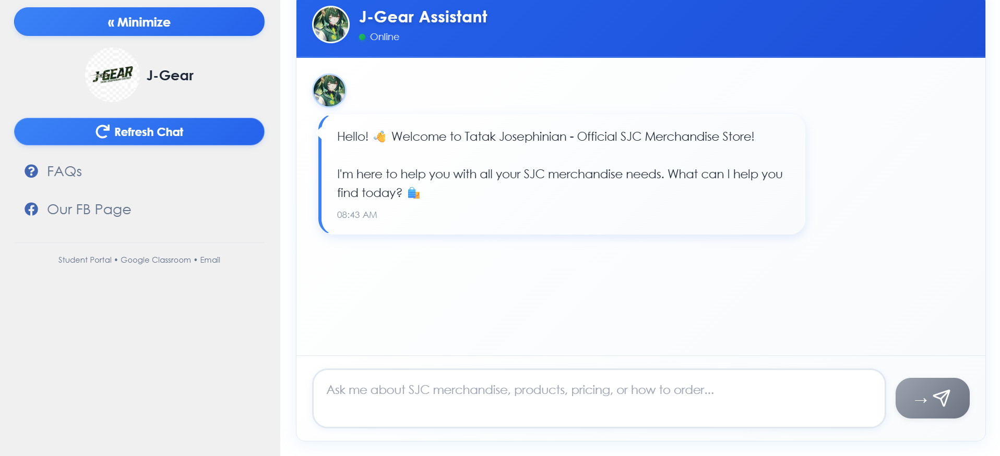

# 🤖 J-Gear Assistant Chatbot

A **keyword-based FAQ chatbot** developed for **BSBA TatakJosephinian merchandise**, created as a **school project requirement** and deployed for public use.

The chatbot assists users by answering frequently asked questions related to **products, pricing, ordering, and official pages** of J-Gear merchandise.

---

## 🌐 Live Demo

🔗 https://jgeartatakjosephinian.netlify.app/

---

## 🖼️ Interface Preview

> *Modern, responsive chat interface designed for easy user interaction.*

---

## 📌 Project Purpose

This project was developed to:
- Serve as a **FAQ assistant** for J-Gear merchandise
- Reduce repetitive inquiries
- Demonstrate practical application of chatbot logic
- Fulfill academic requirements for BSBA coursework

---

## ⚙️ Features

- 💬 Keyword-based response system
- 📦 Merchandise FAQ handling
- 🧭 Quick access to FAQs and official Facebook page
- 🔄 Refresh and reset chat functionality
- 📱 Responsive UI (desktop & mobile friendly)
- 🌐 Deployed via Netlify

---

## 🧠 How It Works

- User inputs a question or keyword
- System matches keywords to predefined responses
- Relevant answer is returned instantly
- No AI or NLP — responses are **rule-based**

---

## 🛠️ Technologies Used

- HTML
- CSS
- JavaScript
- Netlify (Deployment)

---

## 📂 Project Scope & Limitations

- This chatbot uses **keyword matching only**
- It does not use AI, machine learning, or NLP
- Responses are limited to predefined FAQs
- Intended for **educational and demonstration purposes**

---

## 👨‍🎓 Academic Note

This project is part of a **school requirement** and is not an official commercial system.

---

## 📜 License

This project is for **educational use only**.  
All related names, logos, and content belong to their respective owners.
